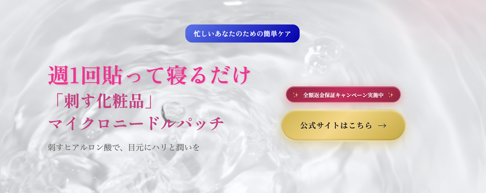

# LP-sample

## 概要

ポートフォリオ提出用に制作した、1ページ完結型のランディングページ（LP）です。
目元に潤いを与える商品を想定し、構成・デザイン・コーディングを行いました。
実際の商品をモデルにしていますが、商品名・内容はダミーに変更しています。

## 制作目的

・HTML / CSS を用いたコーディングスキルの習得
・LPに必要な構成（ファーストビュー、訴求、CTAなど）の理解
・デザインカンプをもとに、意図を汲み取った実装を行うこと

## 使用技術

- HTML
- CSS
- JavaScript
- AOS（Animate On Scroll Library）

## 工夫した点

- ファーストビューでは、商品の「潤い」を視覚的に伝えることを意識しました。背景には水面に水滴が跳ねるイメージ画像を使用し、透明感と洗練された印象を表現しています。
- セクションごとに背景や余白を調整し、情報のまとまりが分かりやすくなるように工夫しました。
- AOSライブラリを使用し、スクロールに合わせたアニメーションを取り入れることで、視線誘導と閲覧体験の向上を意識しています。
- スマートフォンでの閲覧を想定し、レスポンシブ対応を行っています。

## 補足

本LPはデザイン再現・コーディングを目的として制作しています。
JavaScriptとAOSを組み合わせることで、過度にならない範囲で動きを加え、LPとしての訴求力を高めています。
※ 本作品はポートフォリオ用のため、実在の商品・企業とは関係ありません。

## スクリーンショット

